<!-- Header & Hero Section -->
<table width="100%" style="background-color: transparent; border: none;">
  <tr>
    <!-- Left Column: Tech Stack Portrait -->
    <td width="40%" align="center" valign="middle">
      <picture>
        <source media="(prefers-color-scheme: dark)" srcset="./assets/hero-dark.svg">
        <source media="(prefers-color-scheme: light)" srcset="./assets/hero-dark.svg">
        
      </picture>
    </td>
    <!-- Right Column: Terminal Profile Info -->
    <td width="60%" valign="top">
      <h1 style="color: #00E5FF; margin-bottom: 0;">Ananya Joshi</h1>
      
      

        First-year <b>CS & AI engineer</b> at IGDTUW with a <b>9.1 CGPA</b>, specializing in production-grade AI pipelines and algorithmic problem-solving.
      

      

        <b>>_ Reach</b> 
        
        
        
      

      

        <b>>_ Stats</b> 
        
        
      

      
    </td>
  </tr>
</table>

 

## 🛠️ Technical Ecosystem

| 🧠 AI, Data & Languages | 🌐 Web, APIs & Tools |
| :--- | :--- |
|            |            |

## 🚀 Featured Deployments & Projects

| 🌐 [PulseNet (NGO Engine)](https://github.com/ananyajoshi-cseai/PulseNet) | 🌱 [Hydro-Carbon AI](https://github.com/ananyajoshi-cseai/Hydro-Carbon-AI) |
| :--- | :--- |
| Multi-modal intelligence engine built for the Google Solution Challenge to streamline and automate resource routing.       | Zero-runtime static profiler using AST parsing to map theoretical FLOPs to regional grid intensity. *Top 10 Finalist out of 150+ teams at NIT Delhi Hackathon.*       |

| 📈 [CareerFlow AI](https://github.com/ananyajoshi-cseai/CareerFlow-AI) | 🎬 [YouTube Mood Ring](https://github.com/ananyajoshi-cseai/YouTube-Mood-Ring) |
| :--- | :--- |
| An LLM-driven career toolkit featuring a Resume Skill-Gap Analyzer and automated cover letter generator via Google Gemini.       | Automated NLP data pipeline utilizing VADER to ingest and classify emotional feedback across 5,000+ YouTube comments.    -3776AB?style=flat-square)  |

## 📊 Analytics & Impact

  
  

 

  

  <h3 style="color: #00e5ff;">Daily AI Pulse</h3>
  
    
  

